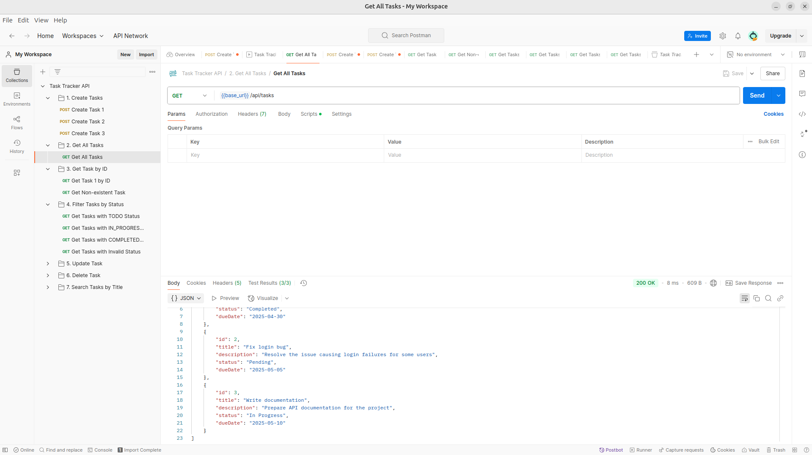

# Task Tracker API - 19APC4030 - S.S.Surendra


- In order to run the project you need java 21 and gradle build tool installed in your machine. 

- To run the project follow the instructions below.
- I ran this on Linux.
```bash
    ./gradlew bootRun
```


Images


